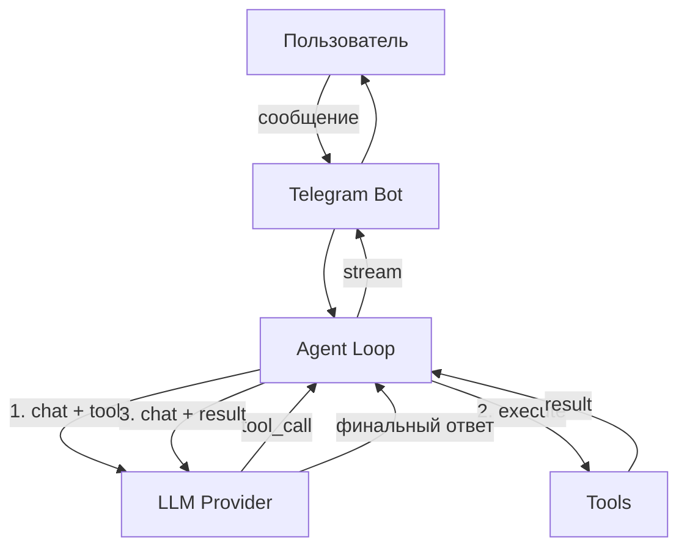

# AI Agent Bot

Telegram-бот с агентным циклом и tool calling. LLM **сама решает** какие инструменты вызвать для ответа на вопрос пользователя — без ручной логики if/else, через протокол function calling.

## Как это работает



**Агентный цикл:**
1. LLM получает вопрос пользователя + описания инструментов
2. Если нужны данные — возвращает `tool_call` вместо текста
3. Код выполняет инструмент и возвращает результат в LLM
4. LLM формулирует финальный ответ на основе реальных данных
5. Цикл повторяется до финального ответа или лимита шагов

---

## Технологии


---

## Доступные инструменты

| Инструмент | Описание |
|------------|----------|
| `web_search` | Поиск информации в интернете через DuckDuckGo |
| `get_weather` | Текущая погода в любом городе (OpenWeatherMap) |
| `convert_currency` | Конвертация валют в реальном времени |
| `create_note` | Создать заметку (сохраняется в PostgreSQL) |
| `list_notes` | Показать все заметки пользователя |
| `delete_note` | Удалить заметку по заголовку |

---

## Провайдеры LLM

Переключение между провайдерами прямо из Telegram командой `/model`.

| Провайдер | Tool calling | Примечание |
|-----------|-------------|------------|
| 🟢 GigaChat | ✅ | Основной провайдер |
| 🔵 YandexGPT | ✅ | лимит 10 запросов/час |
| 🟠 Ollama (qwen3:8b) | ✅ | Локальный, без лимитов |

---

## Как добавить новый инструмент

**1. Создать файл в `tools/`:**

```python
from tools.base import Tool

class MyTool(Tool):
    name = "my_tool"
    description = "Описание — от него зависит насколько точно LLM выбирает инструмент"
    parameters = {
        "type": "object",
        "properties": {
            "query": {"type": "string", "description": "Параметр"}
        },
        "required": ["query"]
    }

    async def execute(self, query: str) -> str:
        # логика инструмента
        return "результат"
```

**2. Зарегистрируй в `tools/setup.py`:**

```python
registry.register(MyTool())
```

---

## Запуск

```bash
git clone https://github.com/makel0ve/ai-agent-bot.git
cd ai-agent-bot

cp .env.example .env

docker-compose up -d

docker exec -it agent_bot_app alembic upgrade head
```

### Команды бота

| Команда | Описание |
|---------|----------|
| `/start` | Начать работу |
| `/new` | Новый диалог |
| `/model` | Выбрать LLM провайдера |
| `/notes` | Показать заметки |
| `/stats` | Статистика |
| `/help` | Справка |
